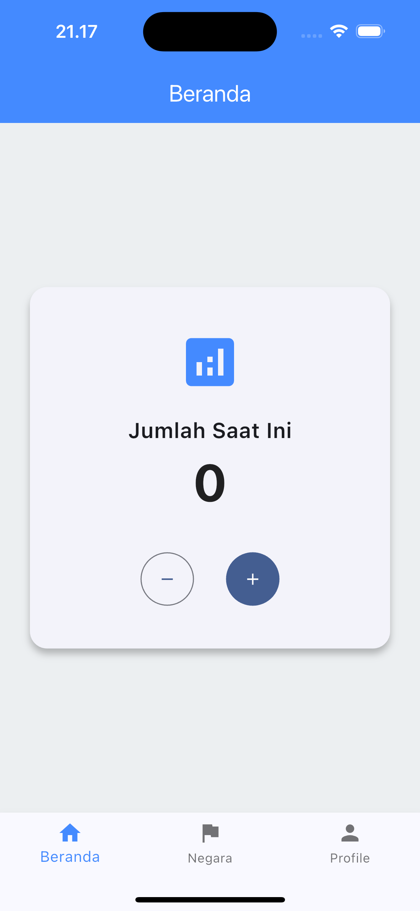
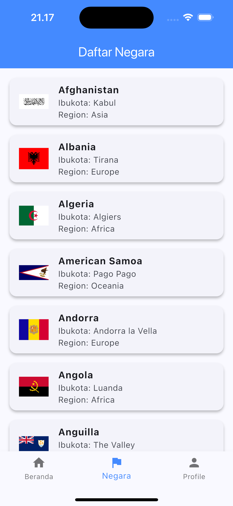
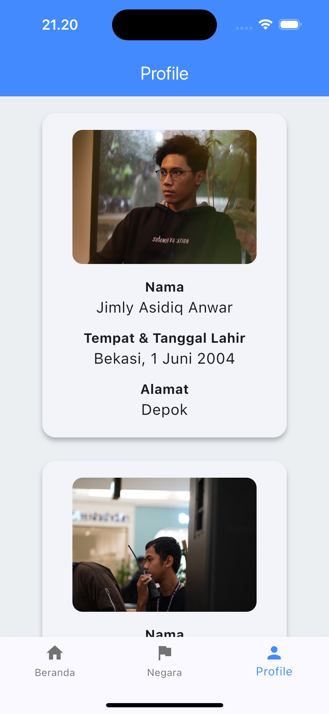

# Aplikasi Flutter 3 Halaman - Kelompok 2

Aplikasi ini merupakan aplikasi flutter sederhana yang terdiri dari 3 halaman, yaitu:
- Counter sederhana untuk menghitung jumlah berapa kali button yang diklik.
- Menampilkan data list negara di dunia dari API.
- Halaman profil dari masing-masing anggota kelompok.

## Anggota Kelompok:
- Jimly Asidiq Anwar - 4522210018
- Muhamad Farhan - 4522210057
- Rizky Galih Dwiyanto - 4522210074

## Screenshots Halaman

### Halaman Counter

### Halaman API

### Halaman Profil

## Penjelasan Tiap Halaman
- **Halaman Counter:** Halaman ini berisi counter sederhana yang terdiri dari button plus dan minus, ketika button plus ditekan maka counter akan bertambah, begitu pun sebaliknya.
- **Halaman API:** Halaman ini berisi tampilan data yang diambil dari API yang memuat daftar negara-negara di dunia dari abjad A-Z.
- **Halaman Profil:** Halaman ini berisi data nama, ttl, alamat, dan foto profil dari anggota kelompok.

## Cara menjalankan aplikasi di Android Studio
1. Open project
2. Pada toolbar kanan, pilih Device Manager --> pilih emulator --> start emulator
3. Pada toolbar atas, pilih device yang akan digunakan
4. Klik tombol run, atau bisa gunakan shortcut Shift + F10
